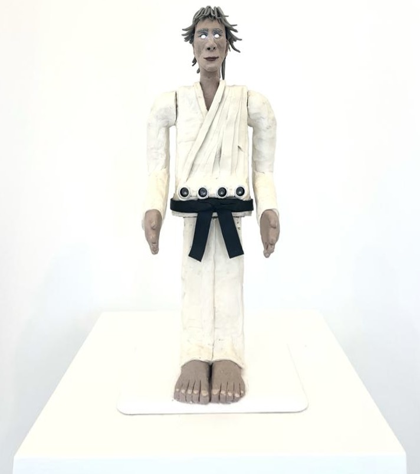

# Karate Sculpture Robot

This repository contains software used to control the karate sculpture robot shown in this [video](https://www.youtube.com/watch?v=go513ycNXyY&ab_channel=DavidJedeikin).

<div align="center">
  
</div>

## Project context :hammer:
The karate sculpture robot is the result of a collaboration between myself and London-based artist [Hugo Knox](https://www.hugoknox.co.uk/about). The robot formed part of Hugo's first ever curated show titled ‘Artificial Realism’ exhibited at [tHEIR Gallery](https://www.their.gallery/about) in November 2023.

Before this project Hugo had been working on plasticine sculptures and had a vision of bringing one of his pieces to life. Hugo is a close friend of mine - he called me up and asked whether I would be up to the challenge. Excited by Hugo's passion and the thought of this multifaceted side-project, I accepted. 

Hugo worked on the external plasticine facade, while I took charge of the engineering. The project required: 
* Mechanical design of the internal structure and facade mounting points
* Electronic design of the power management systems, sensor and actuator wiring
* Control and safety software  

Considering that the robot would be displayed before hundreds of individuals throughout the month, I recognised that safety and durability would be critical requirements for the project.

## Repository preface :blush:
Please note, this was a real project with real deadlines. The mechanical engineering took longer than expected and (due to my own time management & full time job) I was left with only a few evenings to write and test the software. No one likes cutting corners, but it's important to be pragmatic. With the key requirements in mind (safefy and robustness) I consciously chose to skip over implementing hardware abstration layers (HAL), interfaces, dependency injection & unit testing. Instead, I focused on implementing a robust state machine and various safety features. Checkout the [software improvements](docs/software-improvements.md) that I am planning to make in the future. 

## Getting starting & running the code :rocket:

### Hardware requirements
This software is used to control a custom-built robot, of which, only one was ever made. So, without that robot it won't be possible to fully run/test this software out-of-the-box. With that said, if you are interested in the specific robot, have a look at the pictures of the design process [here](https://davidrockjedeikin.com/karate-sculpture-robot). Perhaps you could build your own version of the robot using the same components that I did.   

* 1x [Adafruit Feather nRF52 Bluefruit LE - nRF52832](https://www.adafruit.com/product/3406)
* 3x [High Torque Servo Motor](https://thepihut.com/products/35kg-high-torque-metal-waterproof-servo)
* 2x [HC-SR04 Sonar Sensor](https://www.amazon.co.uk/Smraza-Ultrasonic-Distance-Mounting-Duemilanove-5pcs-Module/dp/B01JG09DCK/ref=sr_1_5?adgrpid=53481003552&dib=eyJ2IjoiMSJ9.V5txWTwtLmny16N_F-RsgtdF-9UQuaWi753gyFHZcg-1bSeiVdQl8l0oEsGYRsWtyj8WaXWbKf4P2oFwScreWrUiQDmsv24KdJ8rmn6ejOh2MlUQqfIwfbE9gUmXZOVLFxYJrVXPMEc4yarKl9UzbpiwZ6rP2w9YSmXA1adrqCmWgZ0G0gV5axN1xVW7TyTV8Mt-KIj130Yfc0gPpIXY22AREvMc8mlCxuca6USlKGhj3vWAE58MBdwAJLnScg4R1l1dMn1AxgcDyr3YqABYLz-V27uS0eDewdmxXQ5YiSE.wKphLUkrVo28UJ50ygJGdhBVIDDlaagRxuGwxIltHvM&dib_tag=se&hvadid=259049745574&hvdev=c&hvlocint=9045999&hvlocphy=9074119&hvnetw=g&hvqmt=e&hvrand=10445171782019032705&hvtargid=kwd-296166699340&hydadcr=22927_1807007&keywords=hc+sr04&qid=1712665752&sr=8-5)
* 1x [Adafruit PCA9685 16-Channel Servo Driver](https://learn.adafruit.com/16-channel-pwm-servo-driver/using-the-adafruit-library)

### Software requirements, building & flashing the code 

As mentioned above, you won't be able to run this software out-of-the-box without the actual robot. However, you should still be able to compile the software and/or deploy it to a similar microprocessor. Feel free to use any of the components or patterns in the repo, but do me a favour and :star: it :smile:. 

The software was written using the [VSCode PlatformIO IDE Extension](https://marketplace.visualstudio.com/items?itemName=platformio.platformio-ide). 

The extension manages all dependencies and the [Quick Start](https://docs.platformio.org/en/latest/integration/ide/vscode.html#quick-start) guide explains how to use the tool very well. This includes how to **build and flash** software that has been written using the tool.  

## Understanding the application software and key state machines :bulb:

The application software is sequential and consists of one high-level and two mid-level StateMachines. In all cases the same underlying State definition `IState` is used and is defined in `src/application/iState.hpp`. `IState` ensures that all states have an `enter` and `runOnce` method. During each sequential loop execution, if the state machine is already in the desired state, then `runOnce` method is executed. If not, the `enter` method of the desired state is executed. 

### The three state machines

1. **The high-level state machines** is implemented in `src/application/application.cpp`. It consists of two states `TrackingState` and `DanceState` and switches between the two based on the state of a physical switch located on the robot. During execution, either the `runOnce` or `enter` methods of the `TrackingState` or `DanceState`are called.
2. **The TrackingState state machine** is implemented in `src/application/trackingState.cpp`. It consits of three states `TooCloseState`, `WithinRangeState` & `OutOfRangeState`. It switches between them based on the minimum distance between the robot and the closest object. During the active `WithinRangeState` the robot attempts to track (or face) the object in front of it.
3. **The DanceState state machine** is implemented in `src/application/danceState.cpp`. It too consits of three states `TooCloseState`, `WithinRangeState` & `OutOfRangeState`. It switches between them based on the minimum distance between the robot and the closest object. Although this state machine contains the same states as the `TrackingStateMachine` it is not coupled with the `TrackingStateMachine` and could have a completely different state machine. During the active `WithinRangeState` the robot _dances_ with the object in front of it, at a speed proportional to the distance between the robot and the object. The closer the object, the faster the robot _dances_. If the object (or person) gets too close, the robot goes into a safety mode and stops dancing.    


## Source code directory structure :file_folder:

* Program entry point: `src/main.cpp`
* High-level application code: `src/application`
* Robot motion generation: `src/motion` 
* Control and math tools: `src/control` 
* Hardware interfacing code: `src/hardware`
* Logging code: `src/logging` 

## Steps to enable Clangd language server 
I personally prefer [Clangd](https://marketplace.visualstudio.com/items?itemName=llvm-vs-code-extensions.vscode-clangd) as a language server over [Microsoft's C++ IntelliSense](https://marketplace.visualstudio.com/items?itemName=ms-vscode.cpptools). 

The following steps are required to enable the Clangd language server.

See `.clang-tidy` for all linting rules 


1. Disable the cpp intelliSense engine

The two cannot co-exists, but PlatformIo depends on the extension for dependency management. You can include the following in your settings.json
```
  "C_Cpp.intelliSenseEngine": "disabled"
```

2. Ensure you have the Python compile commands scripts located in: `scripts`

3. Ensure the scripts are enabled in `platformio.ini`, something like: 
```
extra_scripts = hook_compile_commands.py, pre:generateCompileCommands.py
```